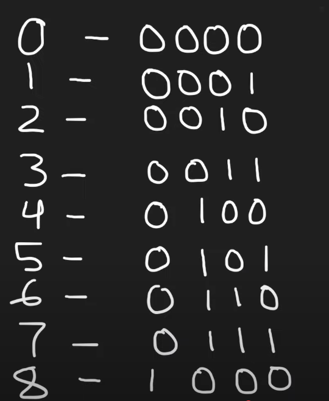

# counting-bits 
## Input 
A single integer `n`.
## Problem 
Given an integer `n`, return the number of bits with `1` for all numbers between `0` and `n` (both inclusive) in an array where `arr[i]` is the number of `1`s for `i`.
## Output 
An array of integers of size `n+1`
## Constraints 
`n` >= 0 and <= 1000
## Observations 
Output array will be size `n+1`, we just have to iterate from `0` to `n` (inclusive).
## Solution 
We can use the same trick as counting `1`s for each value of `i` from `0` to `n` (inclusive), create a vector and store the count of `1`s for each `i` in a sub-loop. 
TC will be O(nk) and SC will be O(n).
```cpp
  void compute() {
    result = std::vector<int>(n + 1, 0);
    for (size_t i{0}; i <= n; ++i) {
      int k{static_cast<int>(i)};
      while (k) {
        ++result[i];
        k &= (k - 1);
      }
    }
  }
```

There's a better solution in terms of time complexity. That relies on observing the binary representation of the numbers. 

Here, we can see that the number of 1s in the representation have a pattern, a repeating pattern with only a slight modification. The repeating part are the positions to the right and the modification is the 1 on a higher position. 
That is, take a look at 2 and 0. The only difference between 2 and 0 is that there's a `1` on 2nd position from the right, but the position on the right which is the 1s position iterates through 0 and 1, so for 2, it is similar to 0 in number of 1s + 1 of `1` that is new, giving it 1 of `1` as total number of 1s. Now look at 3, it is similar to 1 and the only difference is that it has a `1` on its 2nd position, giving it 2 of `1s`. 
Now look at 4, it is again, similar to 0, because the parts on its right resemble 0 with only change of having a `1` in 3rd position, giving it 1 of `1`s. Now look at 5, similarly it is similar to 1 and has its modification, giving it 2 of `1`s, and 6 is similar to 2 and 7 is similar to 3 and now 8 is similar to 0 again and so on.
What does this show us ? 
It shows us, that the parts to the right repeat in the same sequence each time and hence if we simply hold a `1` in our one hand, and just go through the previously occured values in sequence then we don't even need to calculate the number of `1`s, we just need to look at previous values and add a `1`. And this is because the values repeat in the power of 2, that is, the first position has values through 0 and 1, the 2nd position has values through 0,1,2,3, the 3rd position goes through 0, 1, 2, 3, 4, 5, 6,  7 and so on. And each time the only change is the newly appeared `1` in the highest place from the right. 
So what we can do is simply use a very basic DP table, that only adds 1 to a previously calculated value at a specific position, and that position is `current position - the position with the highest power of 2 below the current position`, in other words, if its position 5 then 4 places before, if its position 4, then 4 places before, for 3, it is 2 positions before, for 2 it is 2 positions before and so on.
That is, this specific position is just some position from the start. And it is so because the values and their counts of 1s repeat and go through the same permutation each time.
Like,
0 = 0000
1 = 0001
2 = 0010
3 = 0011
4 = 0100
5 = 0101
6 = 0110
7 = 0111
8 = 1000
9 = ....
and so on, and we can see that for any power of 2, be it 2, 4, 8 and so on, there's a new `1` on a higher and higher position, but the positions to its right ? They go through the same loop of repeating, and hence if we simply ask the question what is the count of `1`s for current_position-$2^{log_2{current_position}}$ (that is current position - the highest power of 2 smaller than the current number floored down), or what is the count of `1`s from the start + whatever position we are higher than the last highest power of 2 ? And add one to the answer of that question, we will have a count without having to explicitly count the number of `1s`.
TC: O(n) and SC: O(n)
Implementation:
```cpp
  void compute() {
    result = std::vector<int>(n + 1, 0);
    if (n > 0) {
      result[0] = 0;
      result[1] = 1;
    }
    for (size_t i{2}; i <= n; ++i) {
      result[i] = 1 + result[i - static_cast<size_t>(std::pow(2, std::floor(std::log2(i))))];
    }
  }
```
However, there's a better implementation
```cpp
  void compute() {
    result = std::vector<int>(n + 1, 0);
    int offset{1};
    for (size_t i{1}; i <= n; ++i) {
        if (offset * 2 == i) {
            offset=i;
        }
      result[i] = 1 + result[i - offset];
    }
  }
```
Quite intuitive and faster.
This results array also serves as our DP table.

TC: O(n) SC: O(n) Time taken to solve: 1 hour + 1 day (carry over)
## Problem Categories 
Dynamic Programming, Bit Manipulation
## Lessons to remember 
1. The basics of DP are very simple, if there's a repeat of some value or there is some problem that firstly can be divided into subproblems, and secondly the subproblems have values that have already been computed then we just need a logic to refer back to the already computed solutions, we can use an array for it generally. And hence we can avoid computation of repeating problems very easily. 
Here, first we observed that our problem of finding the count of `1`s can be broken down into `add 1` and then check the subpositions, and then found out that the subpositions have already been calculated. Then it was very easy to come up with an algorithm to check the already solved problems in our resultant array, and this whole process was what we call DP.
2. Try not to carry over problems, solve them right away. 
